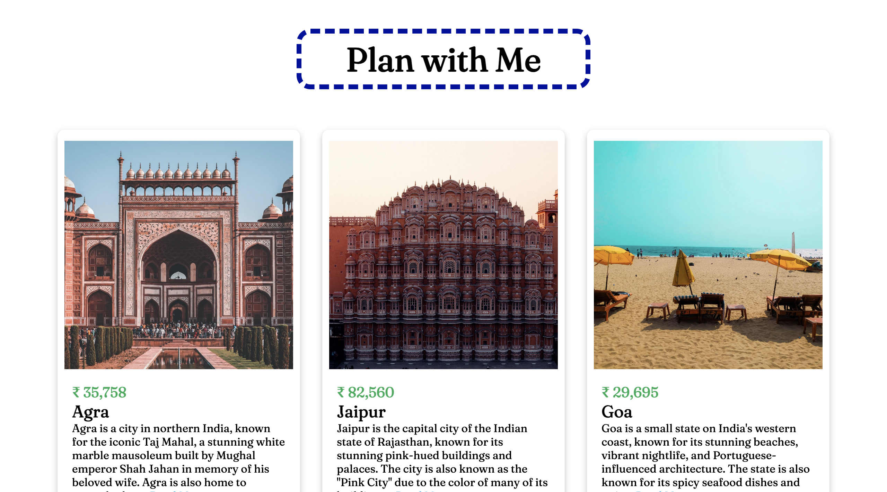

# ✈️ Travelling Project (React)

This is a **React-based travel recommendation project** that displays a limited set of travel destinations. Users can interact with each destination by clicking **"Interested"** or **"Not Interested"**, allowing them to explore and filter the places they would like to visit.

---

## 🎯 Purpose

This project is built as a practice exercise to understand **React state management**, **conditional rendering**, and **event handling**, while building a clean and interactive UI.

---

## ✨ Features

- 📌 Displays a list of travel destinations with images and details
- 👍 Allows users to mark a place as **Interested**
- 👎 Users can also mark a place as **Not Interested** (which can remove it)
- 🔁 Optionally reset the list 
- 🧼 Simple and responsive UI

---

## 🛠 Technologies Used

- **React** – Component-based UI building
- **JavaScript (ES6+)** – Logic and interactivity
- **CSS** – Styling and responsive layout

---

## 🚀 How to Run

1. Clone the repository:
```bash
git clone https://github.com/paveshkanungo/Travelling-Project-using-React.git
cd travelling-project
```

2. Then
```bash
npm start
```

---

## 🌟 Screenshots

> 

---


